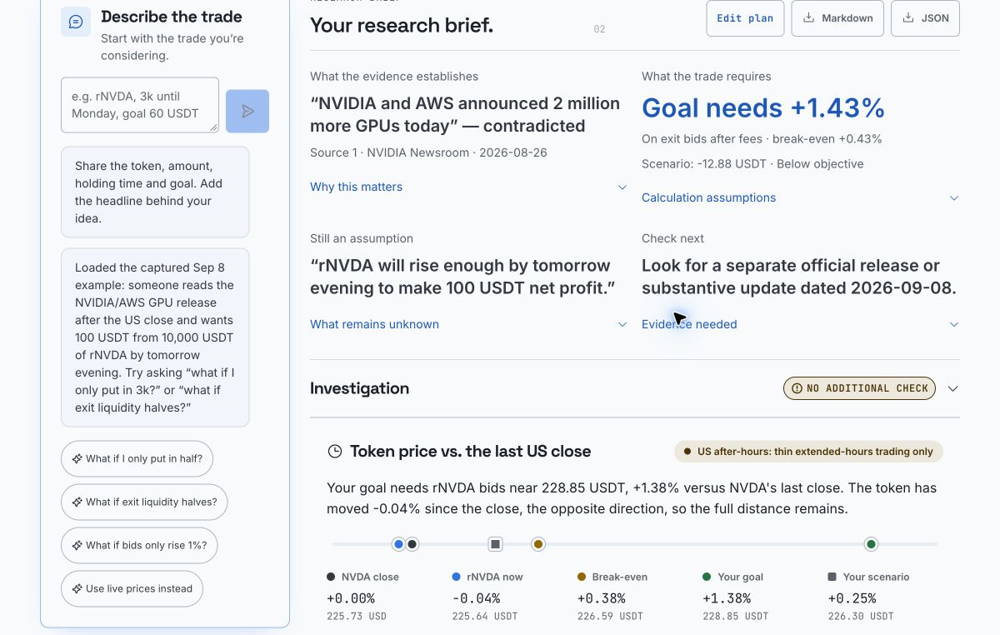

# ThesisGate

**Check the headline. See what your stock-token trade needs after costs.**

ThesisGate turns a trader's idea into a cited evidence check and a calculation of the price move their goal requires. Built for people considering Bitget stock tokens outside US market hours, it keeps the source facts, price assumptions and trade costs visible in one brief.

**[Open the live demo](https://thesisgate.duckdns.org)** · [Worked example](#one-headline-two-conclusions) · [Evidence and evaluation](docs/evaluation.md) · [Run locally](#run-locally)

Bitget Base Camp S2 · **AI Trading Desk / Personalized Research Workbench**

## Try it in one minute

1. Open the demo and select **Replay captured example**. It uses the September 8, 2026 NVIDIA snapshot, clearly labelled as historical.
2. Read the correction and the required price move at the top of the brief. Open the cited source to inspect the announcement.
3. Try **“What if exit liquidity halves?”** or edit the amount. The trade requirements update while unchanged evidence is reused.
4. Export Markdown or JSON to keep the plan, source citations, assumptions and build information together.

For a fresh idea, describe the token, amount, holding time and goal, then select a headline or paste a source passage. The public demo requires no account or API key from the visitor. A recorded walkthrough is **pending**; the [three-minute script](docs/demo-script.md) is available.

## One headline, two conclusions

> “NVIDIA and AWS announced 2 million more GPUs today, so rNVDA will rise enough by tomorrow evening to make 100 USDT net profit.”

The replay puts that thesis against a **September 8, 2026** reference day, a **10,000 USDT purchase notional excluding fees**, and the captured Bitget order book.



*The current interface displaying a historical replay. This example illustrates the workflow; it is not a forecast or a research-quality benchmark.*

| Question | What the brief establishes |
| --- | --- |
| Was this announced today? | The matching NVIDIA/AWS release explicitly announces the event on **August 26**. It contradicts the claim that this announcement was new on September 8. A separate new update would need its own evidence. |
| What move does the goal need? | About **+1.43% in exit bid prices** for 100 USDT net profit; about **+0.43% to break even**. |
| What happens in the selected +0.3% scenario? | Approximately **−12.88 USDT** after the modeled costs. |
| What remains unknown? | The source does not establish whether the required move will happen by tomorrow evening. |

These calculations assume **0.1% fees on each side, unchanged exit depth and no price haircut**. They are conditional sweeps of a historical book, not fills or a probability estimate. Inspect the [captured market data](fixtures/selection-probe.json), [source and close data](fixtures/captured-context.json), or the [archived September 24 model export](public/finished-brief/nvda-captured.md), which retains its original wording and model identity.

## What it does

- **Keeps your plan intact.** Natural language becomes editable token, direction, amount, horizon, objective and scenario inputs. Follow-ups update the same plan.
- **Checks exact claims.** Factual, causal and forecast claims are reviewed against dated sources. Quotes are checked against source text; unsupported conclusions remain insufficient. A conservative rule checks matching official announcement dates independently of the model.
- **Investigates one factual gap.** When an eligible material claim exists, the live app makes at most two targeted source lookups and one additional assessment. Forecast claims remain assumptions. Source failure, no relevant evidence and contradiction are distinct outcomes.
- **Calculates the required outcome.** Decimal.js handles order-book depth, quantity steps, fees, break-even, goal thresholds and scenarios. The brief leads with the key correction and required move; detailed reasoning stays expandable.
- **Makes the result inspectable.** Source dates, citations, snapshot age, assumptions and version information stay in the UI and exports. Economics-only edits reuse the evidence review.

### Integrations with a purpose

| Integration | Question it helps answer |
| --- | --- |
| **Bitget public market API** | What do the available token order book and instrument rules imply for entry, exit and the required price move? Fees are separate editable assumptions. |
| **Bitget Agent Hub MCP and skills** | What do the earnings calendar, dated analyst records, news and market context actually say? ATR is used only as a volatility scale. |
| **NVIDIA Newsroom** | What did the company announce, and when? Full release text is retrieved from the allowlisted official host. |
| **SEC EDGAR** | What revenue was reported for the stated period, or when was a filing made? Company totals do not establish revenue from a particular deal. |
| **Yahoo Finance headlines and quotes** | Which company stories are available, and where does the token trade relative to the underlying stock's last US close? These are public, unofficial endpoints. |

**Source availability is explicit:** Bitget earnings/analyst lookups returned HTTP 503 during the October 4 live check. The original brief remained usable and the failed lookup was disclosed. Available integrations are not a promise that every upstream answers on every request.

## What we have measured

The clearest measured advantage is the calculation of trade requirements. In the **historical 14-case comparison**, the same model received the same source and market data:

| Numeric result | ThesisGate | Same-model assistant with identical data |
| --- | --- | --- |
| Correct goal threshold | **14/14** | 10/14 |
| Correct break-even threshold | **14/14** | 11/14 |

These were builder-designed cases with **non-browsing baselines** and model-assisted evidence judging. Evidence interpretation effectively tied. The results belong to that historical build and do not prove an advantage over a search-enabled assistant or the quality of the new investigation feature. [Artifacts and audit](evidence/e2e-comparison-v2/)

- **Current engineering checks:** 259 unit/integration tests, 34 desktop/mobile browser journeys with zero retries, typecheck, lint and production build passed on October 4.
- **Bounded live investigation check:** repeated supported SEC facts, a cited incorrect-amount contradiction, insufficient deal attribution and explicit source failures. Earlier failed cases are retained. [Recorded evidence](evals/investigation/validation-2026-10-04.json)
- **Independent trader validation: 0 participants.** The prepared comparison uses **Claude with web search** and identical frozen market inputs. It has not been run. [Protocol](evals/practitioner-validation-sheet.md) · [Results status](evals/study/results.md)

The older single-passage research benchmark failed its unique-omission target. The [evaluation guide](docs/evaluation.md) preserves that result, the comparison limitations and reproduction commands.

## Scope and limits

- Supports **rNVDA, rTSLA, rAAPL, rMSFT, rAMZN, rGOOGL and rMETA**, with long and hypothetical short scenarios. Short calculations include a borrow-fee assumption; the app does not establish that a user can borrow or execute the position.
- Research and scenario analysis only: **no order placement, custody, leverage or price forecasts**. An optional Bitget CLI handoff copies commands for the trader to inspect and run; the app sends no orders.
- A request-time book can become stale. Historical replay uses captured inputs and never adds current investigation evidence. The static book does not model future liquidity or time-to-target.
- Evidence conclusions are limited to the supplied records. Company totals cannot prove deal revenue; filing dates cannot prove filing contents. Model extraction and missing-evidence wording can vary between runs.
- Price versus the last US close does not establish how much news is priced in. An ATR multiple is a volatility scale, not a direction or timeline.

## Run locally

Use **Node 24+**; [`.nvmrc`](.nvmrc) pins the contributor version.

```bash
npm ci
npm run dev
```

Open [localhost:3000](http://localhost:3000) and choose **Replay captured example**. Without a model key, deterministic calculations, simple plan edits and the narrow date check still work; the rest of the thesis is explicitly marked unassessed. To enable the full conversation and claim review, follow [local model setup](docs/development.md#optional-local-claim-model).

The public demo has investigation **enabled** and uses `openai/gpt-6-luna-pro` through OpenRouter. Fresh installations default investigation to off. Configuration, limits and the deployed build fingerprint are in the [development guide](docs/development.md#optional-factual-investigation) and [release record](docs/release-notes.md).

## Technical documentation

- [Development, configuration, architecture and API](docs/development.md)
- [Evaluation, historical results and study reproduction](docs/evaluation.md)
- [Deployment and rollback](deploy/README.md) · [Durable quota service](quota-service/README.md)
- [Release notes and observed live verification](docs/release-notes.md)
- [Discovery-based walkthrough script](docs/demo-script.md)
